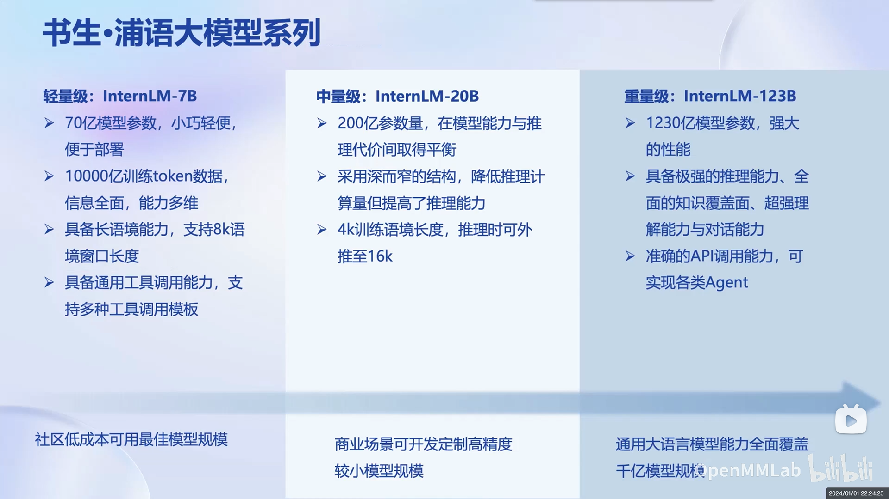
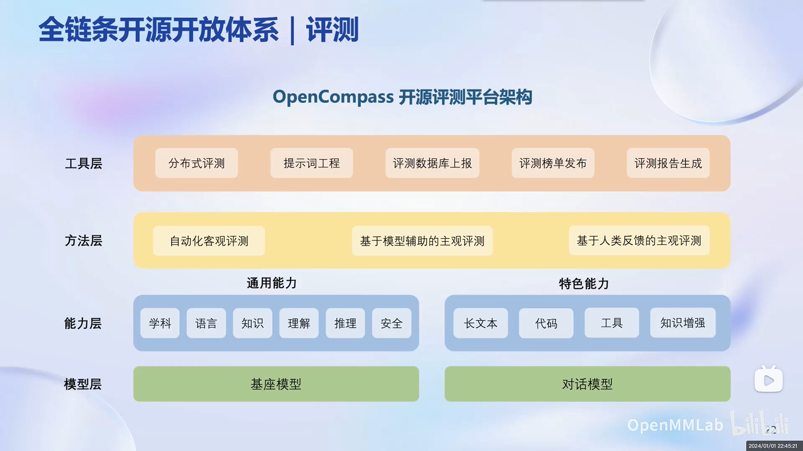

# 书生·浦语大模型全链路开源体系

## 大模型发展

随着 OpenAI 公布 ChatGPT，大语言模型开始进入爆炸发展的阶段，“大语言模型”关键字在 Arxiv 上的出现频率也是近乎指数级的增长。

OpenAI 在大语言模型方面的研究主要围绕 GPT，Generative Pre-trained Transformer，即生成式预训练 Transformer 展开，2018年的 GPT-1，2019年的 GPT-2，再到2020年的GPT-3，2022年的 GPT-3.5，以及2023年的 GPT-4。基于 GPT-3.5 的 ChatGPT 也是在发布后两个月就实现了月活过亿，而 GPT-4 也成为了当今基本公认的最强大的大语言模型。

以前的人工智能研究以专用模型为主，即一个模型解决一个问题。从深度学习理论突破以来，无论是大规模的语音识别，还是以 ImageNet 为例的图像分类，再到人脸识别，下围棋的 AlphaGo，德州扑克 AI，以及专注于预测蛋白质结构的 AlphaFold，它们都是针对于某个特定任务的模型。而大模型带来了发展通用人工智能的可能性，即一个模型可以解决多种任务，应对多种模态。

PPT 资料

## 书生·浦语大模型

### 书生·浦语系列

自2023年6月7日，上海人工智能实验室发布 InternLM （[技术报告](https://github.com/InternLM/InternLM-techreport/blob/main/InternLM.pdf)）以来，书生·浦语开源历程正式拉开序幕。7月6日，在世界人工智能大会（WAIC）上，InternLM-7B-8k 正式开源。后续陆续发布了预训练数据集书生·万卷 1.0；开源了对话升级的 InternLM-Chat-7B v1.1，以及 InternLM-123B（暂未开源）以及 增强版 InternLM-20B（已开源）。

书生·浦语大模型系列主要包括7B，20B，123B三个大小的模型，相关信息如下：

| InternLM-7B | InternLM-20B | InternLM-123B | 
| --- | --- | --- |
| 70亿参数量 | 200亿参数量 | 1230亿参数量 |
| 8K 语境长度 | 推理时可至 16K | - |
| 社区可用规模 | 商业定制规模 | 千亿模型规模 | 

PPT 资料

### 书生·浦语性能

InternLM 系列模型的[性能](https://opencompass.org.cn/leaderboard-llm)均很亮眼。InternLM-7B 的综合性能已经超过 LLaMA-13B，LLaMA-2-7B等，而 InternLM-20B 的模型以不到 LLaMA-2-70B 三分之一的参数量，达到了与 LLaMA-2-70B 相似的性能水平。

| 基座模型 | 综合 | 学科 | 语言 | 知识 | 理解 | 推理 |
| --- | --- | --- | --- | --- | --- | --- |
| InternLM-20B | 59.3 | 62.5 | 55 | 60.1 | 67.3 | 54.9 |
| LLaMA-2-70B | 57.4 | 57.3 | 51.6 | 67.7 | 60.8 | 55 |
| Baichuan2-13B-Base | 49.4 | 51.8 | 47.5 | 48.9 | 58.1 | 44.2 |
| InternLM-7B | 48.7 | 54.9 | 49.2 | 41.3 | 59.3 | 41.6 |
| Baichuan2-7B-Base | 44.4| 46.4 | 48.9 | 44.3 | 48.9 | 39.2 |
| LLaMA-13B | 43.8 | 37.3 | 42.5 | 58.2 | 45.5 | 42.7 |
| LLaMA-2-7B | 41.6 | 35.5 | 44.1 | 53.3 | 42.4 | 40.1 |

PPT 资料

### 从模型到应用

大语言模型可以应用在多种领域，诸如智能客服、个人助手，或是各种行业。然而从模型到真正应用，需要经过一系列步骤。

首先要根据模型评测结果来选择合适的基座模型，如果业务场景不复杂，则可以直接在应用场景进行评测，后对模型进行部署开始应用。而在业务场景复杂的情况下，则需要对模型进行微调。如果算力充足，则可以进行继续训练或是全参数微调，而算力不足的场景则可以选择部分参数微调，如 LoRA 等微调方法。后续根据使用场景判断模型是否需要与环境交互，如需交互，则需要构建相对应的智能体。最后在应用场景进行模型评测，性能达到可用预期后，即可进行部署开始使用。

PPT 资料

## 开源开放体系

针对于以上从模型到应用的全流程，书生·浦语开源开放体系则包括了数据、预训练、微调、评测、部署到智能体的全链条。

PPT 资料

### 数据（[书生·万卷](https://opendatalab.com/OpenDataLab/WanJuan1_dot_0)）

书生·万卷1.0作为多模态预训练数据，其包含了文本、图像、视频等多种模态的数据以更好地促进模型的多模态融合。数据经过了仔细的清洗以及价值观对齐过程，以尽可能提高数据集的质量。

此外，开源开放体系中还包括 [OpenDataLab](https://opendatalab.com/)，OpenDataLab 提供了超过了5400个开放数据集，便于用户检索、下载与使用。目前已经包括了超过60万亿的图像数据和超过1万亿 tokens 的语料。

PPT 资料

### 预训练（[InternLM](https://github.com/InternLM/InternLM)）

[InternLM](https://github.com/InternLM/InternLM) 算法库作为预训练过程算法库，其实现了包括数据并行（Data Parallel，DP）、张量并行（Tensor Parallel，TP）和流水线并行（Pipeline Parallel，PP）在内的多种并行策略，以及 Hybrid-Zero 等技术，从而在千卡上的加速效率达到了92%，超过了 [Megatron-deepspeed](https://github.com/microsoft/Megatron-DeepSpeed)。

PPT 资料

### 微调（[XTuner](https://github.com/InternLM/xtuner)）

由于下游应用过程中，经常会用到增量续训（continual training）和有监督微调（Supervised Fine-Tuning，SFT）两种方法，因此便有了 [XTuner](https://github.com/InternLM/xtuner) 算法库以集成实现。其中，增量续训常用于让基座模型学习到某垂类领域知识。常使用文章、书籍、代码等作为训练数据；而有监督微调常用于让模型学会理解和遵循各类指令（指令跟随微调），或者是注入少量领域知识，常使用高质量对话问答数据作为训练数据。

其中微调又可以分为全量参数微调与部分参数微调，而部分参数微调（又名参数高效微调，Parameter Efficient Fine-Tuning，PEFT）包含 LoRA （Low-Rank Adaptation），Prompt-Tuing 等方法，其中以 LoRA 算法最为经典与通用。其主要思想便是使用低秩矩阵近似原矩阵，从而通过仅训练旁路低秩矩阵来实现原矩阵的更新，公式如下：$h = Wx = (W_0 + AB)x$。

同时 XTuner 适配多种开源生态，如 HuggingFace ；适配多种硬件，8GB 显存即可微调 7B 模型。此外，XTuner 还支持多种自动优化加速，用户无需关注复杂的显存优化与计算加速细节。

PPT 资料

### 评测（[OpenCompass](https://github.com/open-compass/OpenCompass/)）

由于国内外机构对于大语言模型评测的类型与维度不尽相同，[OpenCompass](https://github.com/open-compass/OpenCompass/) 提供了全球领先的开源评测体系。其对于大语言模型的评测分为了六个维度，分别为**学科**、**语言**、**知识**、**理解**、**推理**、**安全**。，包含80个以上的评测数据集，有超过40万条的评测题目。

OpenCompass 评测体系主要包括模型层、能力层、方法层和工具层。其中模型层包括了基座模型与对话模型；能力层包括了包括学科在内的通用能力，以及包括工具在内的特色能力；方法层则包括客观评测、模型辅助主观评测与人类反馈主观评测；而工具层则有分布式评测、提示词工程等工具以更快更好地完成评测。

现阶段 OpenCompass 已经支持了众多模型，用户遍及国内外知名企业与科研机构。

PPT 资料

### 部署（[LMDeploy](https://github.com/InternLM/lmdeploy)）

由于大语言模型存在着内存开销大，输入 shape 不固定的问题，但同时模型结构相对简单，大部分是 decoder-only 的 transformers 结构，大模型部署面临着在低存储设备（如消费级显卡）上的部署、token 生成速度慢的问题。

因此 [LMDeploy](https://github.com/InternLM/lmdeploy) 算法库提供了大模型在显卡上部署的全流程解决方案。其支持包括 Python，gRPC 在内的多种接口，同时提供了4bit、8bit 量化，支持 Turbomind 与 PyTorch 作为推理引擎，可以提供与 openai-server 一致的 api 接口，或是 gradio 服务。

其高效推理引擎使得 LMDeploy 的静态推理性能和动态推理性能都是非常领先的。

PPT 资料

### 应用（[Lagent](https://github.com/InternLM/lagent)，[AgentLego](https://github.com/InternLM/agentlego)）

为了进一步提升大语言模型的能力，解决大语言模型知识更新不及时、数学计算和调用工具的能力，由大语言模型充当智能体的概念被引入。大语言模型通过接收来自人类的指令、反馈等信息，对任务做出规划并调用相对应的工具，在获得工具的输出后，再将其反馈给使用者。如此一来，大语言模型通过借助外部力量，进一步提升了自己的能力。

因此，[Lagent](https://github.com/InternLM/lagent) 算法库为大语言模型带来了调用包括 Google 搜索在内的 API 的能力，带来了调用多种 AI 工具（大多以文本为输入）的能力。带来了调用工具，如计算器和代码解释器的能力，支持了包括 ReAct、ReWoo 和 AutoGPT 在内的多种类型的智能体。

而 [AgentLego](https://github.com/InternLM/agentlego) 算法库则关注于多模态智能体。AgentLego 算法库支持了大部分 OpenMMLab 系列算法库的功能，可以让大语言模型完成 OCR（Optical Character Recognition，光学字符识别），姿态估计或是图像分类任务，以及文字转语音、语音转文字，甚至是多种 AIGC 功能，进一步拓展了大语言模型的能力边界。

PPT 资料

